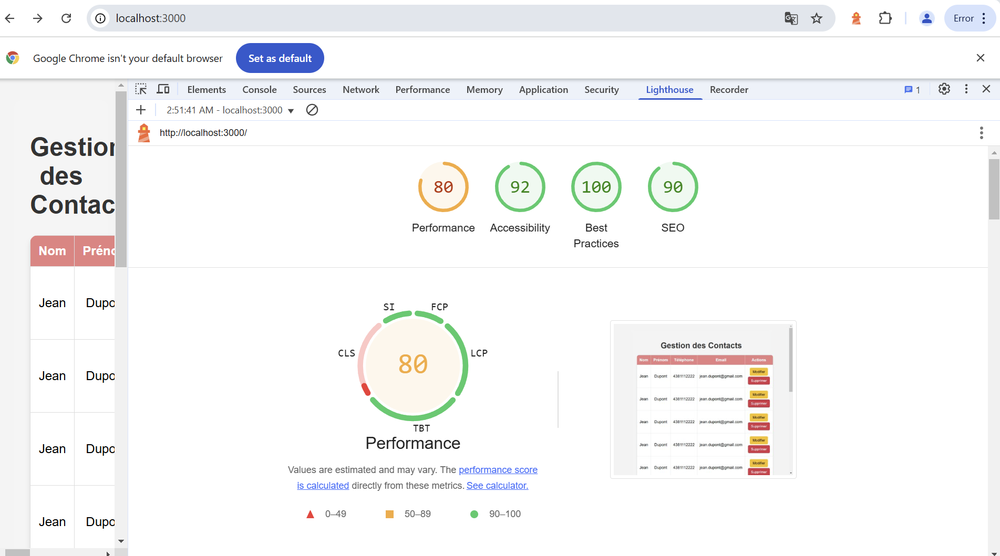

# Application de Gestion de Contacts

Application web pour gérer une liste de contact (ajouter, modifier, supprimer).

## Fonctionnalités de l'application

- Un tableau qui affiche les contacts
- Ajoute d'un contact (Nom, Prénom, Téléphone, Email avec validation)  
- Modifier un contact qui fetch les resultats 
- Supprimer un contact
- Update d'un contact apres modification

## Technologies, outils de test et integration continue

- **Frontend** : HTML, CSS, JavaScript  
- **Backend** : Node.js pour le serveur
- **Stockage de donnees** : fichier json
- **Tests** : Jest,Cucumber,Playwright  
- **CI/CD** : GitHub Actions  

lighthouse report :

